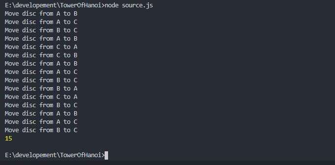

This post will be an attempt to combine two of my favorite things: video games and javascript. Like most people, I’ve had a lot of free time on my hands lately. In an effort to stave off boredom, I’ve been revisiting some of my favorite video games. Luckily for me, it seems as though it’s never been easier to get into homages to the classics. 343 recently dropped Halo 2 for the Master Chief Collection and id Software released Doom Eternal. But there’s one game that always seems to draw me back in: 

Star Wars: Knights of The Old Republic is a role-playing game that was released in 2003. It was the first game I stayed up all night playing. Maybe someday I’ll attempt to quantify why this game is so alluring to me, but that’s a different post. 

When you are on the sith world of Korriban, you’ll enter the Tomb of Naga Sadow where you’ll encounter 3 pillars. The first pillar has 4 active rings, or ‘power systems’ and they must be transferred to the 3rd pillar.  However, you can only move 1 ring at a time and cannot transfer any larger ring onto a smaller ring. This problem is called the Tower of Hanoi

There are three basic rules to this puzzle:

<ul class="post-list">
    <li>Only 1 disk can be moved per turn</li>
    <li>Each turn, the uppermost disk is taken from a pillar and placed on top of another stack of rings, or an empty pillar</li>
    <li>A larger ring can’t be placed on top of a smaller ring</li>
</ul>

With that out of the way, let’s take a look at how we can solve this using javascript (or any language of your choice). I’ll be referring to the left, middle, and right pillars as A, B, and C respectively. To write an algorithm that can solve this, we need to find our base case. Consider our 4 rings: We know that we have to move the bottommost ring to pillar C, and the only way we can do this is to make sure that the 3 smaller rings are on pillar B. So, how do we move 3 rings onto pillar B without violating rule 1? Let’s follow the same pattern that we did for the 4th ring. To move the 3rd ring onto pillar B, the two upper rings must be moved to pillar C. See the pattern? We follow this basic pattern until we get to our base case, which is the topmost ring. From there, it’s easy to solve how to move the single, smallest ring. Let’s write some pseudo-code.

<ol class="post-list">
    <li>Move n-1 rings from the pillar A to pillar B using pillar C</li>
    <li>Move the nth ring from  pillar A to the pillar C</li>
    <li>Move n-1 rings from pillar B to pillar C using pillar A</li>
</ol>

Now that we know our steps, let’s write some code. First, we will define a helper function that will move the rings. 

Now that we have that, let’s define our recursive function. We will have 4 parameters. N (number of rings), source, spare, and target.

Finally, we have to call this function and define our towers. 

If we run this using the Node command from the terminal, what does our output look like? 

And we have our correct output. If you want to test it, I’d suggest using the [math is fun](https://www.mathsisfun.com/games/towerofhanoi.html) version. But how can we be sure this is optimal? According to wikipedia, the minimal number of moves required to solve is 2n-1. Let’s put a counter in our function. 

If 24 - 1 is 15, then the console should log 15 moves. 

So we are solving in the most optimal amount of moves. 

Admittedly, I wasn’t writing this out in code when I was 13. I was randomly moving rings around until the problem was solved. Doing it this way is only slightly less painful. Thanks for reading. 

